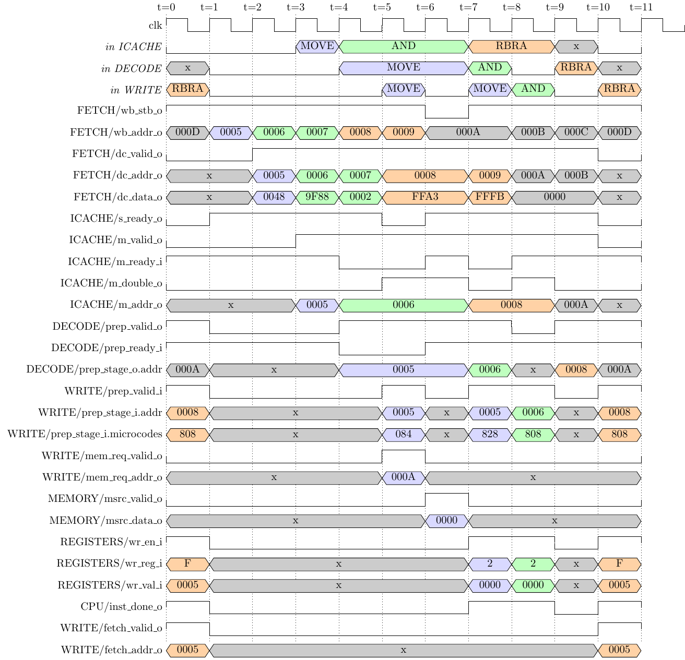

# CPU Replacement

This document describes the effort needed to retro-fit the pipelined QNICE CPU
(https://github.com/MJoergen/qnice_cpu.git) into this design.

This includes a discussion on the changes required as well as some
statistics and code metrics.

## Changes necessary

The changes revolve around the four main architectural differences:

* Harvard Architecture
* Read latency
* Wishbone interface
* Interrupt

### Harvard Architecture
The first very important difference is the Harvard Architecture introduced by
the new CPU design, where the CPU has separate buses for instruction and data
memory.  To investigate the changes required, we must first investigate the
memory map of the QNICE FPGA repo.  Since we now have two separate memory buses,
we must equivalently have two separate memory maps.

Regarding the RAM, it of course needs to be connected to the data bus, but we
also require the option of executing instructions straight from RAM, so there
must be a connection from RAM to the instruction memory bus too.

Regarding the ROM, it will of course be used to fetch instructions, but it also
needs data memory bus access, to allow reading data from the ROM.

We are therefore left with the requirement, that both RAM and ROM need
connection to both instruction and data buses. This is conveniently possible
using the Dual Port feature of the Block RAMs in the FPGA.

An added complexity here is that we have both the `ROM` and the `PORE_ROM`. The
distinction between them is controlled by the `mmio_mux.vhd` file, which also
controls the data bus memory map. I've chosen to keep the instruction memory map
(which is simpler) within the `env1.vhd` top level file, so as not to clutter the
`mmio_mux.vhd` file. I've instead added the output signal `use_pore_rom`, which
simply mirrors the already existing internal signal `use_pore_rom_i`.

The following table shows an overview over which address regions should be
connected to the instruction and data buses, respectively.

| Address   | Use          | Instruction | Data      |
| --------- | ------------ | ----------- | --------- |
| 0000-7FFF | ROM/PORE\_ROM | Yes         | Read-Only |
| 8000-FEFF | RAM          | Yes         | Yes       |
| FF00-FFFF | I/O          | No          | Yes       |

Note: The instruction memory bus is always read-only.

Note: The table above dis-allows the possibility of executing instructions
directly from the I/O space. This choice is a non-issue in this design, but
worth mentioning.

### Read latency
Another important change from the old to the new CPU design, is that the new
design expects the data read to appear on the **following** clock cycle. This
change seems easy - just add a register to the returned data. However, care must be
taken that the data bus multiplexing (where all read data is OR'ed together) is
still applicable.  Note: Even though this increased read latency **will**
increase the number of clock cycles needed to execute a program. the added
pipeline will enable a faster clock rate for the CPU. The overall effect is a
net win, see the discussion at
(https://github.com/MJoergen/qnice_cpu/blob/main/doc/README.md#Optimizations)
under the heading "Rejected: zero-latency Wishbone slaves".

### Wishbone interface
Both memory buses use the Wishbone interface. There are several issues here:

* This is a transaction based protocol, where the request is pulsed (using STB)
  and the corresponding address (ADDR) is only valid when STB is asserted. The
  I/O devices in particular expect the address to be valid in every clock cycle.
  It is therefore necessary to sample-and-hold the address from a valid STB
  pulse.
* The request may be stalled indefinitely using the STALL signal. This is not
  needed in the current design, and we may simple keep STALL low.
* Both read and write requests must be acknowledged using the ACK signal. In
  most cases the request takes only one clock cycle, and the ACK signal becomes
  a simple one-clock-cycle delayed version of STB. However, the existing design
  supports variable read latency using the `wait_for_data` signal. This is
  easily handled by setting ACK to the inverted `wait_for_data`. None of the
  existing I/O devices make use of this `wait_for_data`, so this has not been
  tested yet. 
  Furthermore, the new CPU design does indeed allow for a Wishbone slave (only those
  connected to the data memory bus) to continually drive ACK to 1, regardless of any STB
  signal or active transactions.

### Interrupt
Support for interrupts is not yet implemented in the new CPU design.


## Statistics

This section gives some metrics (based on Vivado 2023.1).

### Current design
The current design (commit b1fb36c) shows the following utilization for the `QNICE_CPU`
entity.

The utilization report shows:

* Slice LUTs      = 3497
  * LUT as Logic  = 2089
  * LUT as Memory = 1408
* Slice Registers =  396
* Block RAM       =    0
* Slices          = 1022

Timing report (using Vivado 2023.1, Clock period 20.00 ns, frequency 50.00 MHz):

* WNS      : 0.151 ns

Timing report (using Vivado 2023.1, Clock period 18.75 ns, frequency 53.33 MHz):

* WNS      : -0.327 ns

This shows that the timing at 50 MHz is marginal, and the frequency is close to maximal.

Performance: (using `mandel_perf_test.asm`)

* Cycles       : 8,126,056
* Instructions : 2,466,906
* Wall time    : 0.163 seconds (@ 50 MHz)

This gives an Cycles Per Instruction (CPI) of 3.29.

### New design

Note: The extra logic added to `env1.vhd` is not included here. It is only a handful of
LUTs and Registers.

* Slice LUTs      : 938
*   LUT as Logic  : 914
*   LUT as Memory :  24
* Slice Registers : 586
* BRAM            :   2
* Slices          : 355

A note on the BRAM usage: They contain the register banks, which use a total of 256 x 8 x
16 bits = 4 kBytes. This should perhaps reside in a single BRAM, but since the register
block has two read ports, data is duplicated with one read port each. This accounts for
the 2 BRAMs.

Even disregarding the register file, the new CPU uses less than half of "LUT as Logic",
but almost twice the amount of "Slice Registers".

Timing report (using Vivado 2023.1, Clock period 20.00 ns, frequency 50.00 MHz):

* WNS      : 0.807 ns

Timing report (using Vivado 2023.1, Clock period 13.75 ns, frequency 72.73 MHz):
* WNS      : 0.172 ns

Timing report (using Vivado 2023.1, Clock period 12.50 ns, frequency 80.00 MHz):
* WNS      : -0.467 ns (within EAE)
* WNS      : -0.220 ns (increased EAE multicycle count)

Once again timing at 72.73 MHz is close to marginal. Note that the EAE contains large
combinatorial multi-cycle paths, and with a short clock period the cycle count had to be
increased. However, that was not enough to close timing.


Performance: (using `mandel_perf_test.asm`)

* Cycles       : 4,893,719
* Instructions : 2,477,180
* Wall time    : 0.067 seconds (@ 73 MHz)

This gives an CPI of 1.98.

The overall speedup in walltime is a factor of 0.163 / 0.067 = 2.4.

Note: The number of instructions has increased by approximately 0.4%. The reason
may not be entirely clear at first, but an explanation is given in the following
section.

## Increased instruction count
Further investigation reveals the increased instruction count is directly
related to the "faster" CPU. In particular, when waiting for a fixed number of
**clock cycles** in a tight loop, the faster CPU will execute more instructions
in the given time.

Specifically, in the monitor function `UART$PUTCHAR` in `uart_library.asm` we see
the following code snippet:

```
UART$PUTCHAR    INCRB                       ; Get a new register page
                MOVE IO$UART_SRA, R0        ; R0: address of status register
                MOVE IO$UART_THRA, R1       ; R1: address of transmit register
_UART$PUTC_WAIT MOVE @R0, R2                ; read status register
                AND 0x0002, R2              ; ready to transmit?
                RBRA _UART$PUTC_WAIT, Z     ; loop until ready
                MOVE R8, @R1                ; Print character
                DECRB                       ; Restore the old page
                RET
```

The tight loop around `_UART$PUTC_WAIT` consists of three instructions and takes
up five words of instruction memory. The breakdown of cycle count (measured as
clock cycles from previous to current assertion of `cpu_ins_cnt_strobe`).

| Instruction     | OLD   | NEW   |
| --------------- | ----- | ----- |
| MOVE @R0, R2    | 4     |  1    |
| AND <imm>, R2   | 4     |  2    |
| RBRA <label>, Z | 4     |  7    |

So we see that the old design uses 12 clock cycles per loop iteration, whereas
the new design uses just 10 clock cycles. Note also that the conditional branch
is more expensive in the new design, due to the pipeline flush.

### Breakdown of looping in the new CPU design

The following diagram is generated from the following three instructions:

```
0005  0048        LOOP     MOVE @R0, R2
0006  9F88  0002           AND 0x0002, R2
0008  FFA3  FFFB           RBRA LOOP, Z
```

The three instructions has its own colour, and the top three rows summarise
which instruction occupies which pipeline register in each cycle. A flat line
there means the stage is empty.



The first and last column are identical, thus repeating every ten cycles.

* **t=0**: the `RBRA` retires. `inst_done_o` pulses, `R15` is written with the
  branch target `0x0005`, and `fetch_valid_o` redirects FETCH and flushes the
  Icache. Everything FETCH had speculatively read past the branch — the four
  words `0x000A` to `0x000D`, greyed out in the diagram — is thrown away.
* **t=1**: FETCH issues the first instruction-memory request of the new stream,
  for `0x0005`.
* **t=2**: that word (`0x0048`) comes back and is handed to the Icache. The
  pipeline is empty: DECODE, PREPARE and WRITE all have nothing.
* **t=3**: the Icache offers it and DECODE accepts `MOVE @R0, R2`. Note
  `m_double_o` is low — only one word is buffered so far — which is enough,
  because this instruction has no immediate operand.
* **t=4**: the `MOVE` sits in DECODE's output register and the Sequencer in
  PREPARE issues its first micro-operation, `0x084` (`MEM_READ_SRC` +
  `REG_MOD_SRC`). It holds `prep_ready_i` low, because a second micro-operation
  is still to come.
* **t=5**: WRITE puts the read of the device word on the data bus
  (`mem_req_addr_o` = `0x000A`).
* **t=6**: the device word returns on `msrc_data_o` and the Sequencer can
  finally issue the second micro-operation, `0x828` (`LAST` + `MEM_WAIT_SRC` +
  `REG_WRITE`). This is the loop's only genuine stall. In the same cycle DECODE
  accepts the `AND`, this time consuming two words at once.
* **t=7**: the `MOVE` retires and `R2` is written.
* **t=8**: the `AND` retires. It is a single micro-operation, so it follows one
  cycle behind. The device bit is still clear, so the `Z` flag it leaves in
  `R14` is set and the branch will be taken. DECODE accepts the `RBRA`.
* **t=9**: WRITE is idle. The `RBRA` is only now in DECODE's output register.
* **t=10 = t=0**: the `RBRA` retires and redirects again.

Read as a narrative, the bullets above invite an answer that does not survive
arithmetic: that the ten cycles are three instructions plus the overheads around
them. The useful reading is that they are **one instruction-memory refill**.
FETCH delivers one word per clock cycle, the loop is five words long, and the
branch puts a fixed cost either side of those five. Follow the
`FETCH/dc_addr_o` row, and the cycles in which the Icache actually takes what is
offered there (`ICACHE/s_ready_o` high):

| cycles | | |
| --- | --- | --- |
| t=0, t=1 | 2 | the redirect, then the instruction memory's read latency |
| t=2 – t=7 | 6 | the loop's five words, one per cycle — but see t=5 |
| t=8, t=9 | 2 | decoding the last word, and carrying it to WRITE |

Two plus six plus two is the ten. The first word of the loop lands in the Icache
at t=2 and the last at t=7 — five words spread over six cycles, because at t=5
the Icache refuses the word FETCH is offering it. The last one still has to be
decoded at t=8 and to reach WRITE at t=9, which retires it at t=10 = t=0.

Note what is *not* in that accounting: the data read. Its latency is hidden —
the request goes out at t=5 and the word is back at t=6, inside the window in
which the loop is fetching its remaining instruction words anyway.

Not quite hidden, though. The one row in the diagram that the read is
responsible for is the refusal at t=5, and that chain is worth spelling out,
because it runs backwards through four modules:

1. The `MOVE` expands into two micro-operations. The Sequencer in PREPARE issues
   one per cycle and holds `DECODE/prep_ready_i` low until it has issued the
   last of them.
2. That second micro-operation carries `MEM_WAIT_SRC`, so it cannot be issued
   until the device word arrives at t=6. `prep_ready_i` is therefore low for
   *two* cycles, t=4 and t=5, rather than one.
3. DECODE cannot accept a new instruction while PREPARE is holding it, so it
   leaves its `fetch_ready_o` low at t=4 and t=5. That is the row drawn as
   `ICACHE/m_ready_i`: the two are the same net, seen from the Icache's side.
4. The Icache buffers two words, and by t=5 it is holding both — the `AND` and
   its immediate operand (`m_addr_o` = `0x0006`, `m_double_o` high). Nothing is
   draining it, so it has nowhere to put a third word and drops `s_ready_o`
   at t=5.
5. FETCH is offering `0x0008` in that cycle and is refused. It re-offers it at
   t=6, `0x0009` follows at t=7, so the Icache can only offer the `RBRA` as a
   pair at t=8 — one cycle later than it otherwise would, which is the tenth
   cycle of the loop.

That last step is what the reader sees as the bubble at t=9: WRITE is idle
because the `RBRA` was decoded a cycle late, not because of anything happening
in WRITE.

One thing in the diagram is a red herring, and it is worth naming so that it is
not mistaken for a fourth link in that chain. `FETCH/wb_stb_o` is low at t=6:
the back-pressure does reach FETCH, and an instruction-memory request cycle does
go unused. But it costs nothing, because the request it delays is for `0x000A`,
which the branch discards anyway. FETCH issues nine requests per iteration and
only five of them survive the branch; the instruction bus is busy in nine cycles
out of ten, doing five cycles of useful work.

