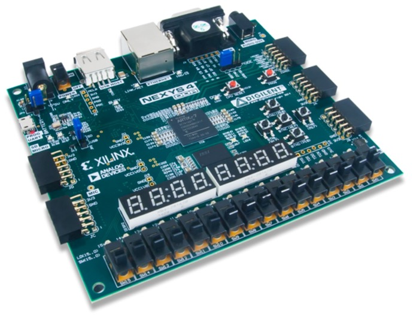

Hardware
========

We created QNICE-FPGA as a portable System-on-a-Chip, so that it should be
possible to synthesize it for any suitably powerful FPGA board. This folder
contains the FPGA vendor specific and board (hardware instance) specific files
necessary to synthesize the QNICE-FPGA bitstream.

The structure of this folder is:

```
<fpga-vendor>/<board (hardware)>/<toolchain (IDE)>
```

General advise for porting
--------------------------

* The root file for the system is `vhdl/env1.vhdl`.

* Make sure that you connect at least the IO pins for PS2, VGA, UART 
  and the two switches (`SWITCHES<0>` and `SWITCHES<1>`).

* In the file `hw/xilinx/nexys4ddr/ISE/env1.ucf` you will find advise 
  about how to do the mapping from the NETs to the hardware.

* The system is designed to run at 50 MHz. Other speeds would break various
  timings (see also [TODO.txt](../TODO.txt) to learn more). `env1` expects to
  receive a 100 MHz clock, which it then divides down to the
  50 MHz clock `SLOW_CLOCK`.

* EAE's combinatorial division networks take longer than the regular 50 MHz 
  clock period, so be sure to specify a timing constraint for your specific
  hardware/toolchain combination. `hw/xilinx/nexys4ddr/ISE/env1.ucf` can be
  used as an inspiration.

Nexys 4 DDR and Nexys A7
------------------------



Currently, our reference development board is a 
[Nexys 4 DDR](https://store.digilentinc.com/nexys-4-ddr-artix-7-fpga-trainer-board-recommended-for-ece-curriculum/),
which has been retired by Nexys but you can still get it on eBay. As far as
we know, the sucessor
[Nexys A7](https://store.digilentinc.com/nexys-a7-fpga-trainer-board-recommended-for-ece-curriculum/)
is quite compatible, so we currently assume, that you can use the Nexys 4 DDR
IDE files to also synthesize for the Nexys A7.

### ISE 14.7

We created the original QNICE-FPGA using
[Xilinx' ISE 14.7](https://www.xilinx.com/support/download/index.html/content/xilinx/en/downloadNav/vivado-design-tools/archive-ise.html).
Open the project `hw/xilinx/nexys4ddr/ISE/env1.xise` to synthesize using ISE.

### Vivado <Version>

Work in progress ...  `xilinx/nexys4ddr/Vivado`

MEGA65
------

### SD Card

The MEGA65 features two SD card slots: One at the rear side of the case and
one at the bottom of the case under a cover.

Currently, QNICE-FPGA only supports the one at the bottom under the cover.

### Using Serial I/O as STDIN/STDOUT

#### Preparing your PC or Mac

* You need to use the `TE-0790` JTAG programmer as described in the chapter
  "Flashing the FPGAs and CPLDs in the MEGA65" of the MEGA65 User's Guide.

* On some operating systems you might need to install FTDI drivers. On a Mac
  it works without additional drivers.

* The MEGA65 will show up as "Digilent USB Device" in your OS and/or terminal
  program.

* Choose "Port 2" of this device and set your terminal program to 115.200 baud,
  8-N-1 (no CTS/RTS). Connect to the MEGA65.

#### Routing QNICE-FPGA's STDIN/STDOUT

Press the `RESTORE` key together with the `1` to toggle STDIN between the
MEGA65 keyboard and the UART. Press `RESTORE` plus `2` to toggle STDOUT
between VGA and the UART.

Caveat: After switching STDIN to another input, you still need to press one
more key on the old input, before the switch to the new input is finally active.

#### Technical Background Info

The initial Nexys 4 DDR version of QNICE-FPGA sports 16 switches, which are
directly linked with the "Switch Register" `0xFF12`
(see also `IO$SWITCH_REG` in the file `dist_kit/sysdef.asm`). The rightmost
switch is Bit #0.

|Switch Register| Value | Meaning                 |
|-------------- |-------|-------------------------|
|Bit #0         | 0     |STDIN  = UART            |
|Bit #0         | 1     |STDIN  = MEGA65 keyboard |
|Bit #1         | 0     |STDOUT = UART            |
|Bit #1         | 1     |STDOUT = MEGA65 VGA out  |

The above mentioned `RESTORE` key combinations are toggling the bits #0 and #1
of the Switch Register.

### Porting Notes

* The VDAC which generates the VGA image needs to be wired like this
  ```
  vdac_sync_n <= '0';
  vdac_blank_n <= '1';  
  ```

* The MEGA65 keyboard driver components `mega65kbd_to_matrix` (hardware driver)
  and `matrix_to_ascii` (ASCII generator) both need a counter signal as
  input: `matrix_col_idx`. This signal needs to count upwards on the rising
  edge of the same clock as all the components use from 0 to 7 and then
  flip back to 0 again.
